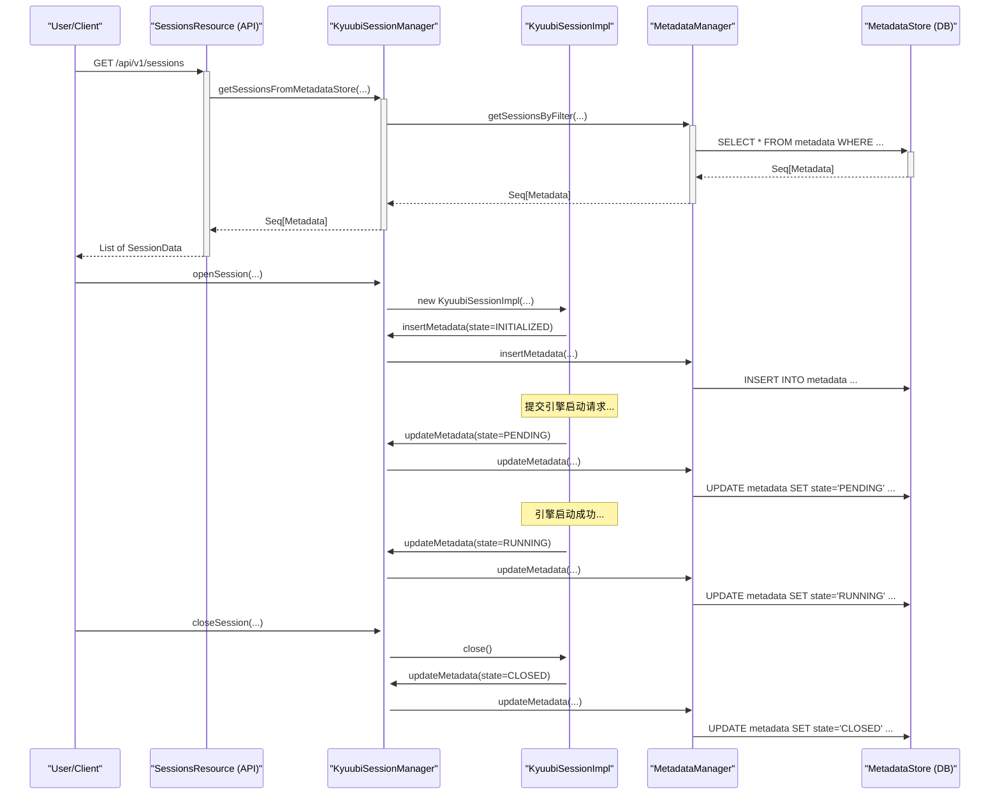
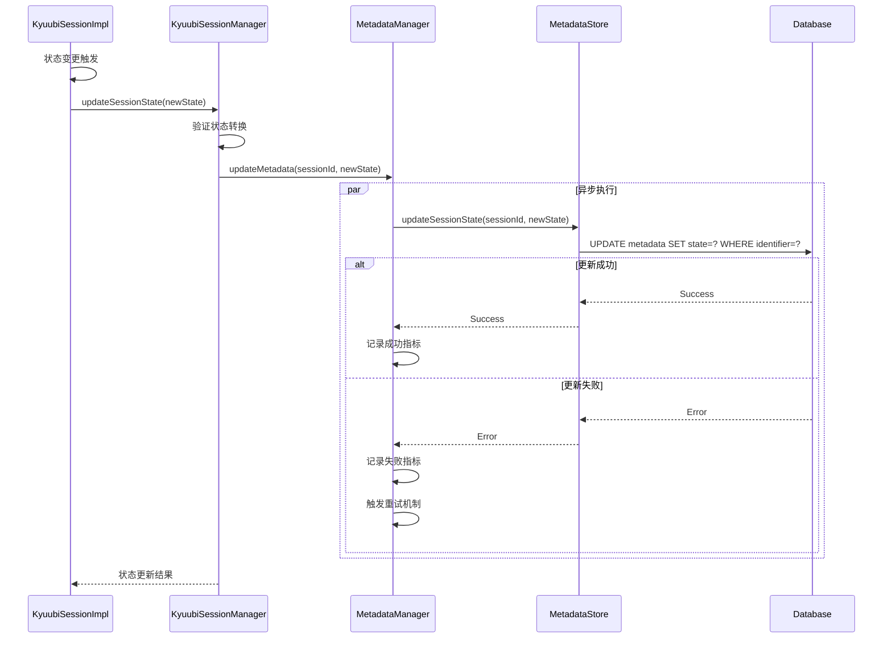
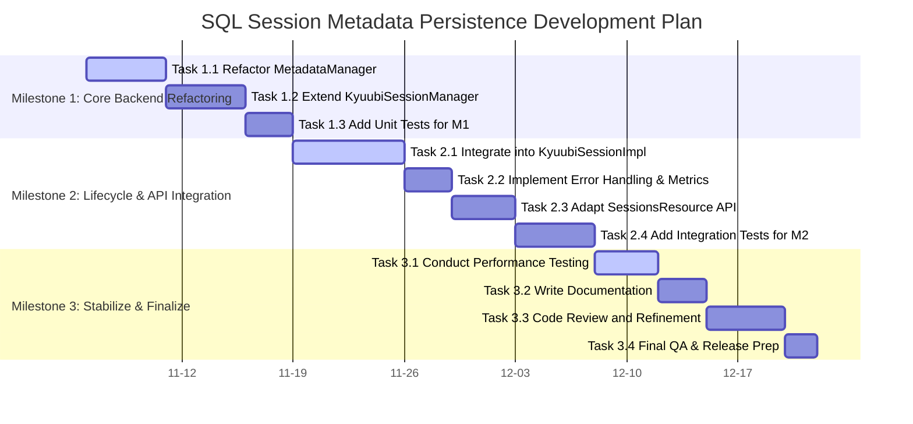

# “SQL会话元数据持久化”技术设计总览

## 1. 项目目标与范围

### 1.1 目标

本项目的核心目标是实现 Kyuubi **SQL 会话**
的元数据持久化存储。通过将会话的关键信息（如用户、状态、创建时间、配置等）保存到后端的 `MetadataStore`（通常是 JDBC
数据库），我们旨在达成以下业务价值：

* **提升可观测性**: 即使在 Kyuubi Server 重启后，管理员和用户依然能够查询到历史 SQL 会话的记录，便于审计、问题排查和成本分析。
* **增强系统健壮性**: 为未来实现“会话恢复”(Session Resumption)等高可用性功能奠定数据基础。
* **统一管理模型**: 将 SQL 会话的管理方式向现有的“批处理会话”(Batch Session)对齐，形成统一的会话生命周期和元数据管理模型。

### 1.2 范围

**范围内 (In Scope):**

* 在会话 `open()` 和 `close()` 的生命周期钩子中，添加对元数据的 `INSERT` 和 `UPDATE` 操作。
* 重构 `MetadataManager`，提供一个能够同时服务于 SQL 会话和批处理会话的通用查询接口。
* 修改 `/sessions` REST API，使其能够从 `MetadataStore` 中查询和展示 SQL 会话信息。
* 引入必要的配置项，允许用户启用或禁用此特性，确保向后兼容。
* 为 SQL 会话引入与批处理一致的、更精细的状态模型 (`PENDING`, `RUNNING`, `FINISHED`, `ERROR`)。

**范围外 (Out of Scope):**

* **会话恢复**: 本项目仅实现元数据持久化，不包含断线重连、会话状态恢复等功能。
* **引擎端状态同步**: 本项目不处理引擎（如 Spark Driver）内部状态的持久化。
* **实时查询性能优化**: 虽然会考虑性能影响，但实现复杂的缓存或查询优化策略（如Caffeine cache）超出了本次范围，可作为后续改进。

---

## 2. 核心概念：SQL会话 vs. 批处理会话

为了精确设计，我们必须清晰定义两种会话在元数据层面的异同：

| 特性       | SQL 会话 (SQL Session)                   | 批处理会话 (Batch Session)                  | 共享元数据           |
|:---------|:---------------------------------------|:---------------------------------------|:----------------|
| **定义**   | 用户通过 Thrift 或 REST API 提交的交互式或长连接会话。   | 用户通过 REST API 提交的、生命周期有限的离线作业。         | SessionType 字段  |
| **生命周期** | PENDING -> RUNNING -> FINISHED / ERROR | PENDING -> RUNNING -> FINISHED / ERROR | 状态 (State)      |
| **核心属性** | `engineType`, `requestName` (引擎名)      | `resource`, `className`, `requestArgs` | 标识符, 用户, IP, 配置 |
| **数据模型** | **不应**包含批处理特有的字段。                      | 包含作业提交所需的特定字段。                         | 基础会话信息          |

这种区分是本次设计的关键，确保了数据模型的清晰、准确和低耦合。

---

## 3. 架构变更与组件交互

新特性将主要影响以下四个核心组件。它们之间的交互关系如下图所示：



**组件职责变更**:

* **`KyuubiSessionImpl`**: 会话的具体实现。将在 `open()` 和 `close()` 方法中，负责触发元数据的插入和更新操作。
* **`KyuubiSessionManager`**: 会话管理器。负责接收来自 `KyuubiSessionImpl` 的请求，并调用 `MetadataManager`
  的相应方法。新增一个 `getSessionsFromMetadataStore` 方法，供 API 层调用。
* **`MetadataManager`**: 元数据管理器。将进行**核心重构**，把现有的 `getBatches`
  等专用方法，抽象为通用的 `getSessionsByFilter` 方法，作为所有会话类型查询的统一入口。
* **`SessionsResource`**: REST API 层。将修改 `sessions()` 方法的实现，当新特性启用时，调用 `KyuubiSessionManager`
  的新方法从数据库获取数据，而不是从内存中获取。

---

## 4. 核心设计原则

为确保新特性的高质量和可维护性，我们遵循以下核心设计原则：

1. **统一查询接口 (Unified Query Interface)**
    * **原则**: 避免为每种会话类型创建专用的查询方法。
    * **实施**: 将 `MetadataManager` 中的 `getBatches` 重构为 `getSessionsByFilter`
      。所有上层调用（无论是查询批处理还是SQL会话）都应通过此方法，并利用 `MetadataFilter` 对象来区分会话类型。

2. **统一状态模型 (Unified State Model)**
    * **原则**: SQL 会话应拥有独立的、清晰的生命周期状态模型，以便于统一监控和管理。
    * **实施**: 我们将为 SQL 会话引入一个全新的 `SessionState` 枚举，而不是复用 `OperationState`
      。这将确保领域模型的清晰性和未来的可扩展性。关于 `SessionState`
      的详细设计，包括其状态定义、转换规则和实现规划，请参阅 [02_Session_Lifecycle_Integration.md](./02_Session_Lifecycle_Integration.md)。

3. **区分数据模型 (Differentiated Data Model)**
    * **原则**: 保持元数据模型的精确性，避免数据污染。
    * **实施**: 在 `KyuubiSessionManager` 中创建 `Metadata` 对象时，通过模式匹配（`match-case`）来区分 `KyuubiSessionImpl`
      和 `KyuubiBatchSession`。**绝不**为 SQL 会话填充如 `resource`、`className` 等批处理专属字段，保持其为 `null` 或默认值。

4. **向后兼容与可配置 (Backward Compatibility & Configurability)**
    * **原则**: 新功能的引入不应破坏现有系统的行为。
    * **实施**: 引入一个全局配置项 `kyuubi.session.metadata.store.enabled`（默认为 `false`）。所有新逻辑（包括 API
      的数据源切换和生命周期钩子）都将受此开关控制，确保用户可以平滑升级。

# 元数据存储扩展设计 (Metadata Store Extension)

## 1. 数据模型扩展

为了支持 SQL 会话的持久化，我们需要在现有的 `metadata` 表中存储其元数据。我们**不会新增列**
，而是复用现有列，并通过 `sessionType` 字段来区分不同的会话类型。

### 1.1 `metadata` 表字段使用说明

下表详细说明了 `metadata` 表中各字段对于 **SQL 会话** 和 **批处理会话** 的使用情况。

| 字段名              | 数据类型      | SQL 会话 (SQL Session)                           | 批处理会话 (Batch Session)                        | 备注                                 |
|:-----------------|:----------|:-----------------------------------------------|:---------------------------------------------|:-----------------------------------|
| `identifier`     | `VARCHAR` | **使用** (会话句柄ID)                                | **使用** (批处理ID)                               | **共享主键**                           |
| `sessionType`    | `VARCHAR` | **使用** (值为 "INTERACTIVE")                      | **使用** (值为 "BATCH")                          | **核心区分字段**                         |
| `realUser`       | `VARCHAR` | **使用** (真实用户)                                  | **使用** (真实用户)                                | 共享                                 |
| `username`       | `VARCHAR` | **使用** (代理用户)                                  | **使用** (代理用户)                                | 共享                                 |
| `ipAddress`      | `VARCHAR` | **使用** (客户端IP)                                 | **使用** (客户端IP)                               | 共享                                 |
| `kyuubiInstance` | `VARCHAR` | **使用** (Kyuubi Server地址)                       | **使用** (Kyuubi Server地址)                     | 共享                                 |
| `state`          | `VARCHAR` | **使用** (INITIALIZED, PENDING, RUNNING, IDLE等等) | **使用** (PENDING, RUNNING, FINISHED, ERROR等等) | **共享状态字段，但枚举值根据`sessionType`有所不同** |
| `resource`       | `VARCHAR` | **不使用** (应为 NULL)                              | **使用** (主资源路径, 如JAR/Py文件)                    | 批处理专属                              |
| `className`      | `VARCHAR` | **不使用** (应为 NULL)                              | **使用** (主类名)                                 | 批处理专属                              |
| `requestName`    | `VARCHAR` | **使用** (引擎默认名)                                 | **使用** (用户定义的作业名)                            | 语义不同但复用                            |
| `requestConf`    | `TEXT`    | **使用** (会话配置)                                  | **使用** (作业配置)                                | 共享                                 |
| `requestArgs`    | `TEXT`    | **不使用** (应为 NULL)                              | **使用** (作业参数)                                | 批处理专属                              |
| `createTime`     | `BIGINT`  | **使用** (创建时间戳)                                 | **使用** (创建时间戳)                               | 共享                                 |
| `engineType`     | `VARCHAR` | **使用** (如 "SPARK_SQL")                         | **使用** (如 "SPARK_BATCH")                     | 共享                                 |
| `clusterManager` | `VARCHAR` | **不使用** (应为 NULL)                              | **使用** (如 "YARN", "K8S")                     | 批处理专属                              |
| `engineId`       | `VARCHAR` | **使用** (引擎应用ID)                                | **使用** (引擎应用ID)                              | 共享                                 |
| `engineName`     | `VARCHAR` | **使用** (引擎应用名)                                 | **使用** (引擎应用名)                               | 共享                                 |
| `engineUrl`      | `VARCHAR` | **使用** (引擎跟踪URL)                               | **使用** (引擎跟踪URL)                             | 共享                                 |
| `engineError`    | `TEXT`    | **使用** (引擎启动失败信息)                              | **使用** (引擎启动失败信息)                            | 共享                                 |
| `endTime`        | `BIGINT`  | **使用** (结束时间戳)                                 | **使用** (结束时间戳)                               | 共享                                 |
| `priority`       | `INTEGER` | **不使用** (应为默认值 10)                             | **使用** (批处理优先级)                              | 批处理专属                              |

### 1.2 `MetadataFilter` 类定义

为了支持灵活的元数据查询，我们使用现有的 `MetadataFilter` 类来构建查询条件。该类定义如下：

```scala
// file: kyuubi-server/src/main/scala/org/apache/kyuubi/server/metadata/api/MetadataFilter.scala

package org.apache.kyuubi.server.metadata.api

import org.apache.kyuubi.session.SessionType.SessionType

/**
 * The conditions to filter the metadata.
 */
case class MetadataFilter(
                           sessionType: SessionType = null,
                           engineType: String = null,
                           username: String = null,
                           state: String = null,
                           requestName: String = null,
                           kyuubiInstance: String = null,
                           createTime: Long = 0L,
                           endTime: Long = 0L,
                           peerInstanceClosed: Boolean = false)
```

#### 字段说明

| 字段名                  | 类型            | 描述           | 示例                                              |
|:---------------------|:--------------|:-------------|:------------------------------------------------|
| `sessionType`        | `SessionType` | 会话类型过滤条件     | `SessionType.INTERACTIVE` 或 `SessionType.BATCH` |
| `engineType`         | `String`      | 引擎类型过滤条件     | `"SPARK_SQL"`, `"FLINK_SQL"`                    |
| `username`           | `String`      | 用户名过滤条件      | `"alice"`, `"bob"`                              |
| `state`              | `String`      | 会话状态过滤条件     | `"RUNNING"`, `"CLOSED"`, `"ERROR"`              |
| `requestName`        | `String`      | 请求名称过滤条件     | `"my-spark-session"`                            |
| `kyuubiInstance`     | `String`      | Kyuubi实例过滤条件 | `"kyuubi-server-1:10009"`                       |
| `createTime`         | `Long`        | 创建时间下限       | `1698746400000L`                                |
| `endTime`            | `Long`        | 结束时间上限       | `1698746400000L`                                |
| `peerInstanceClosed` | `Boolean`     | 是否查询已关闭的对等实例 | `false`                                         |

#### 使用示例

```scala
// 查询所有交互式会话
val interactiveFilter = MetadataFilter(sessionType = SessionType.INTERACTIVE)

// 查询特定用户的运行中会话
val runningFilter = MetadataFilter(
  username = "alice",
  state = "RUNNING"
)

// 查询指定时间范围内的会话
val timeRangeFilter = MetadataFilter(
  createTime = 1698746400000L,
  endTime = 1698832800000L
)
```

### 1.3 查询条件扩展

**现状**:
现有的接口已经是通用的，完全依赖 `MetadataFilter` 来过滤不同类型的会话。

---

## 2. DAO 层设计 (`MetadataStore` 接口)

`MetadataStore`
是数据访问对象（DAO）层，负责与后端数据库直接交互。为了支持更通用的查询，我们需要确保其核心查询方法的签名能够满足上层 `MetadataManager`
的需求。

### 2.1 核心查询方法

`MetadataStore` 的核心查询方法 `getMetadataList` 的签名和行为应如下：

```scala

trait MetadataStore {
  /**
   * Get the metadata list with filter conditions, offset and size.
   * @param filter    the metadata filter conditions.
   * @param from      the metadata offset.
   * @param size      the size to get.
   * @param orderBy   the order by column, default is the auto increment primary key, `key_id`.
   * @param direction the order direction, default is `ASC`.
   * @return selected metadata list.
   */
  def getMetadataList(
                       filter: MetadataFilter,
                       from: Int,
                       size: Int,
                       orderBy: Option[String] = Some("key_id"),
                       direction: String = "ASC"): Seq[Metadata]
}
```

---

## 3. MetadataManager 重构设计

我们将把现有的 `getBatches` 方法重构为 `getSessionsByFilter`，作为未来所有会话查询的唯一入口。

### 3.1 统一查询接口：`getSessionsByFilter`

```scala
// file: kyuubi-server/src/main/scala/org/apache/kyuubi/server/metadata/MetadataManager.scala

/**
 * 根据灵活的过滤器获取会话列表，并支持分页。
 *
 * @param filter 用于过滤结果的条件对象。
 * @param from   分页查询的起始索引。
 * @param size   分页查询返回的最大记录数。
 * @return 元数据对象序列。
 */
def getSessionsByFilter(filter: MetadataFilter, from: Int, size: Int): Seq[Metadata] = {
  require(from >= 0, "Parameter 'from' must be non-negative")
  require(size > 0, "Parameter 'size' must be positive")

  // 核心逻辑保持不变，但其通用性更明确。
  // 通过 Metrics 包装对底层 store 的调用。
  _metadataStore.getMetadataList(filter, from, size)
}
```

### 3.2 兼容性保证：废弃的 `getBatches`

为了保证向后兼容性，我们保留原有的 `getBatches` 方法，但将其标记为废弃，并内部代理到新的 `getSessionsByFilter`
方法。

```scala
// file: kyuubi-server/src/main/scala/org/apache/kyuubi/server/metadata/MetadataManager.scala

@deprecated("Use getSessionsByFilter with a BATCH sessionType filter", "1.9.0")
def getBatches(filter: MetadataFilter, from: Int, size: Int): Seq[Metadata] = {
  // 内部转换为通用查询，添加 BATCH 过滤条件
  val batchFilter = filter.copy(sessionType = Some("BATCH"))
  getSessionsByFilter(batchFilter, from, size)
}
```

### 3.3 保留旧方法以实现向后兼容

为了不破坏现有的代码调用，我们可以暂时保留 `getBatches` 方法，但将其标记为废弃，并让其内部调用新的 `getSessionsByFilter`
方法。

```scala
// file: kyuubi-server/src/main/scala/org/apache/kyuubi/server/metadata/MetadataManager.scala

@deprecated("Use getSessionsByFilter with a BATCH sessionType filter", "1.9.0")
def getBatches(filter: MetadataFilter, from: Int, size: Int): Seq[Metadata] = {
  val batchFilter = filter.copy(sessionType = SessionType.BATCH)
  getSessionsByFilter(batchFilter, from, size)
}
```

这种方式提供了平滑的过渡期，鼓励开发者迁移到新的通用 API，同时保证了系统的稳定性。

# 会话生命周期集成设计 (Session Lifecycle Integration)

## 1. 详细设计：会话状态机 (Session State Machine)

### 1.1 引入独立的 `SessionState` 枚举

为了精确管理 SQL 会话的生命周期，并与现有的批处理会话（Batch Session）模型对齐，我们引入一个全新的、独立的 `SessionState` 枚举。

#### 1.1.1 设计决策：独立状态机 vs. 复用 `OperationState`

尽管项目初期曾考虑复用 `OperationState`，但经过深入分析，我们决定创建一个独立的 `SessionState`。这主要基于以下核心设计原则：

* **领域驱动设计 (Domain-Driven Design)**: `Session` 和 `Operation` 在 Kyuubi 的领域模型中扮演着不同的角色。`Session`
  是用户交互的上下文，而 `Operation` 是在 `Session` 内部执行的具体任务。为每个核心领域对象维护独立的状态机，可以使我们的代码更清晰地反映业务现实。
* **高内聚，低耦合 (High Cohesion, Low Coupling)**: 创建独立的 `SessionState`
  将所有与会话生命周期相关的逻辑（状态定义、转换规则）内聚在单一模块中，避免了 `Session` 与 `Operation`
  模块之间产生不必要的依赖，使得两者未来的演进可以互不影响。
* **未来可扩展性 (Future-Proofing)**: `Session` 的生命周期可能会演化出 `Operation` 所不具备的特有状态（如 `IDLE`
  ）。如果现在复用 `OperationState`，未来扩展时将增加不必要的风险和复杂性。

#### 1.1.2 `SessionState` 状态定义

我们为 `SessionState` 定义以下状态，以全面覆盖其生命周期：

| 状态 (State)      | 描述                                            |
|:----------------|:----------------------------------------------|
| **INITIALIZED** | 会话已被初始化，但尚未向引擎提交启动请求。这是会话的起始状态。               |
| **PENDING**     | 已向资源管理器（如 YARN/K8s）提交了引擎启动请求，正在等待引擎分配和启动。     |
| **RUNNING**     | 引擎已成功启动并与 Kyuubi Server 建立连接。会话处于活动状态，可以执行操作。 |
| **IDLE**        | 会话在配置的一段时间内没有执行任何操作，处于空闲状态。                   |
| **TIMEOUT**     | 会话因长时间处于 `IDLE` 状态或超出其总生命周期而被系统自动关闭。          |
| **CLOSED**      | 会话被用户或客户端主动关闭。这是一个正常的终结状态。                    |
| **ERROR**       | 会话在生命周期内的任何阶段遇到无法恢复的错误（如引擎启动失败）。这是一个异常的终结状态。  |

#### 1.1.3 状态转换图 (State Transition Diagram)

`Session` 的生命周期状态转换路径如下所示：

```mermaid
graph TD
subgraph "Session Lifecycle"
direction LR
[*] --> INITIALIZED
INITIALIZED --> PENDING
PENDING --> RUNNING
PENDING --> ERROR
RUNNING --> IDLE
RUNNING --> CLOSED
RUNNING --> ERROR
IDLE --> RUNNING
IDLE --> TIMEOUT
IDLE --> CLOSED
CLOSED --> [*]
ERROR --> [*]
TIMEOUT --> [*]
end
```

#### 1.1.4 实现规划 (Implementation Plan)

1. **创建新文件**: 在 `kyuubi-common` 模块的 `org.apache.kyuubi.session` 包下创建一个新的 Scala
   文件 `SessionState.scala`。
2. **定义枚举**: 在 `SessionState.scala` 中，创建一个 `SessionState` 枚举对象，包含上述定义的所有状态。
3. **实现转换验证**: 模仿 `OperationState`，在 `SessionState` 中添加一个 `validateTransition` 方法，用于强制执行上图所示的合法状态转换。
4. **定义终结状态**: 在 `SessionState` 中定义一个 `isTerminal` 方法或 `terminalStates` 集合，用于快速判断一个会话是否已结束。

---

## 2. `SessionState.scala` 完整代码实现

为了将上述设计转化为可执行的代码，我们提供以下 `SessionState.scala` 的完整实现。这份代码可以直接集成到 `kyuubi-common`
模块的 `org.apache.kyuubi.session` 包中。

```scala
/*
 * Licensed to the Apache Software Foundation (ASF) under one or more
 * contributor license agreements.  See the NOTICE file distributed with
 * this work for additional information regarding copyright ownership.
 * The ASF licenses this file to You under the Apache License, Version 2.0
 * (the "License"); you may not use this file except in compliance with
 * the License.  You may obtain a copy of the License at
 *
 *    http://www.apache.org/licenses/LICENSE-2.0
 *
 * Unless required by applicable law or agreed to in writing, software
 * distributed under the License is distributed on an "AS IS" BASIS,
 * WITHOUT WARRANTIES OR CONDITIONS OF ANY KIND, either express or implied.
 * See the License for the specific language governing permissions and
 * limitations under the License.
 */

package org.apache.kyuubi.session

import org.apache.kyuubi.KyuubiSQLException

/**
 * Represents the lifecycle state of a Kyuubi Session.
 */
object SessionState extends Enumeration {

  type SessionState = Value

  /**
   * INITIALIZED: Session is initialized but not yet active.
   * PENDING: Engine start request has been submitted.
   * RUNNING: Session is active and can execute operations.
   * IDLE: Session is idle and has no active operations.
   * TIMEOUT: Session has been closed due to inactivity.
   * CLOSED: Session has been closed by the user.
   * ERROR: Session has encountered an unrecoverable error.
   */
  val INITIALIZED, PENDING, RUNNING, IDLE, TIMEOUT, CLOSED, ERROR = Value

  /**
   * A set of states that are considered terminal. A session in a terminal
   * state can no longer transition to any other state and is considered finished.
   */
  val terminalStates: Set[SessionState] = Set(TIMEOUT, CLOSED, ERROR)

  /**
   * Validates a state transition based on the state diagram. Throws KyuubiSQLException
   * if the transition is invalid.
   *
   * @param oldState The current state.
   * @param newState The new state to transition to.
   */
  def validateTransition(oldState: SessionState, newState: SessionState): Unit = {
    // A session in a terminal state cannot transition to any other state.
    if (terminalStates.contains(oldState) && oldState != newState) {
      throw KyuubiSQLException(
        s"Illegal session state transition from a terminal state: $oldState to $newState")
    }

    (oldState, newState) match {
      // Normal lifecycle transitions
      case (INITIALIZED, PENDING) =>
      case (PENDING, RUNNING) =>
      case (RUNNING, IDLE) =>
      case (IDLE, RUNNING) =>
      case (IDLE, TIMEOUT) =>

      // Allow transition to CLOSED or ERROR from any non-terminal state
      case (_, CLOSED) if !terminalStates.contains(oldState) =>
      case (_, ERROR) if !terminalStates.contains(oldState) =>

      // Allow transition from a state to itself (no-op)
      case (s1, s2) if s1 == s2 =>

      // Any other transition is considered illegal.
      case _ => throw KyuubiSQLException(
        s"Illegal session state transition from $oldState to $newState")
    }
  }

  /**
   * Checks if a state is terminal.
   *
   * @param state The state to check.
   * @return True if the state is terminal, false otherwise.
   */
  def isTerminal(state: SessionState): Boolean = {
    terminalStates.contains(state)
  }
}
```

---

## 3. 会话状态同步机制 (Session State Synchronization)

### 3.1 状态同步架构设计

为了确保 `KyuubiSessionImpl` 中的状态变更能够及时同步到数据库，我们设计了以下同步机制：

#### 3.1.1 同步策略

* **实时同步**: 状态变更立即触发元数据更新，确保数据库中的状态与内存状态保持一致。
* **异步执行**: 元数据更新操作在后台线程中执行，避免阻塞主要业务流程。
* **失败重试**: 提供有限次数的重试机制，处理临时性数据库连接问题。
* **降级处理**: 当元数据存储不可用时，会话功能正常运行，仅记录错误日志。

#### 3.1.2 状态同步流程



### 3.2 `KyuubiSessionImpl` 状态变更集成点

#### 3.2.1 核心状态变更方法

在 `KyuubiSessionImpl` 中，我们将添加以下方法来处理状态同步：

```scala
// file: kyuubi-server/src/main/scala/org/apache/kyuubi/session/KyuubiSessionImpl.scala

import org.apache.kyuubi.session.SessionState._
import org.apache.kyuubi.metrics.MetricsConstants._
import scala.concurrent.Future
import scala.util.{Success, Failure}

class KyuubiSessionImpl extends AbstractSession {

  @volatile private var _sessionState: SessionState = INITIALIZED
  private val metadataUpdateExecutor = ThreadUtils.newDaemonSingleThreadExecutor("session-metadata-updater")

  /**
   * 安全地更新会话状态，包括状态验证和元数据同步
   */
  private def updateSessionState(newState: SessionState): Unit = {
    val oldState = _sessionState

    try {
      // 验证状态转换合法性
      SessionState.validateTransition(oldState, newState)

      // 更新内存状态
      _sessionState = newState

      // 异步更新元数据
      executeMetadataOperation(
        sessionManager.asInstanceOf[KyuubiSessionManager]
          .updateSessionMetadata(handle.identifier.toString, newState.toString),
        "update"
      )

      info(s"Session ${handle.identifier} state changed from $oldState to $newState")

    } catch {
      case e: KyuubiSQLException =>
        error(s"Invalid state transition from $oldState to $newState for session ${handle.identifier}", e)
        throw e
    }
  }

  /**
   * 执行元数据操作，包含监控指标和错误处理
   */
  private def executeMetadataOperation(operation: => Unit, operationType: String): Unit = {
    implicit val ec = scala.concurrent.ExecutionContext.fromExecutor(metadataUpdateExecutor)

    val future = Future {
      val timer = MetricsSystem.timer(METADATA_OPERATION_DURATION, "operation" -> operationType).time()
      try {
        operation
        MetricsSystem.counter(METADATA_OPERATION_TOTAL, "operation" -> operationType, "status" -> "success").inc()
      } catch {
        case NonFatal(e) =>
          MetricsSystem.counter(METADATA_OPERATION_TOTAL, "operation" -> operationType, "status" -> "fail").inc()
          error(s"Failed to execute metadata operation: $operationType for session ${handle.identifier}", e)
        // 不重新抛出异常，避免影响主业务流程
      } finally {
        timer.stop()
      }
    }

    // 异步处理结果，记录严重错误
    future.onComplete {
      case Success(_) =>
        trace(s"Metadata operation $operationType completed successfully for session ${handle.identifier}")
      case Failure(e) =>
        error(s"Metadata operation $operationType failed for session ${handle.identifier}", e)
    }
  }
}
```

#### 3.2.2 具体状态变更触发点

在 `KyuubiSessionImpl` 的生命周期中，状态变更将在以下关键点触发：

**1. 会话初始化完成** (`open()` 方法开始)

```scala
override def open(): Unit = {
  // 初始化会话元数据
  sessionManager.asInstanceOf[KyuubiSessionManager].insertSessionMetadata(this)
  updateSessionState(INITIALIZED)

  // 继续原有的 open 逻辑...
  super.open()
}
```

**2. 引擎启动请求提交** (`submitEngineStart()` 调用后)

```scala
private def submitEngineStart(): Unit = {
  try {
    // 提交引擎启动请求
    engineManager.submitEngineRequest(this)
    updateSessionState(PENDING)
  } catch {
    case NonFatal(e) =>
      updateSessionState(ERROR)
      throw e
  }
}
```

**3. 引擎启动成功** (引擎连接建立后)

```scala
def onEngineStarted(engineRef: EngineRef): Unit = {
  this.engineRef = Some(engineRef)
  updateSessionState(RUNNING)
  info(s"Engine started successfully for session ${handle.identifier}")
}
```

**4. 引擎启动失败** (引擎启动超时或失败)

```scala
def onEngineStartFailed(cause: Throwable): Unit = {
  updateSessionState(ERROR)
  error(s"Engine start failed for session ${handle.identifier}", cause)
}
```

**5. 会话空闲检测** (空闲超时触发)

```scala
private def checkIdleTimeout(): Unit = {
  if (isIdle && (System.currentTimeMillis() - lastActivityTime) > idleTimeout) {
    updateSessionState(IDLE)
  }
}

private def onIdleTimeout(): Unit = {
  updateSessionState(TIMEOUT)
  close()
}
```

**6. 会话主动关闭** (`close()` 方法调用)

```scala
override def close(): Unit = {
  try {
    updateSessionState(CLOSED)
    super.close()
  } catch {
    case NonFatal(e) =>
      updateSessionState(ERROR)
      error(s"Error occurred during session close for ${handle.identifier}", e)
      throw e
  } finally {
    // 清理资源
    metadataUpdateExecutor.shutdown()
  }
}
```

### 3.3 引擎启动回调集成点

#### 3.3.1 引擎生命周期监听器

为了准确捕获引擎启动的成功和失败事件，我们需要在 `KyuubiSessionImpl` 中实现引擎生命周期监听：

```scala
// file: kyuubi-server/src/main/scala/org/apache/kyuubi/session/KyuubiSessionImpl.scala

trait EngineLifecycleListener {
  def onEngineStarting(): Unit

  def onEngineStarted(engineRef: EngineRef): Unit

  def onEngineStartFailed(cause: Throwable): Unit

  def onEngineTerminated(): Unit
}

class KyuubiSessionImpl extends AbstractSession with EngineLifecycleListener {

  /**
   * 引擎开始启动时的回调
   */
  override def onEngineStarting(): Unit = {
    updateSessionState(PENDING)
    info(s"Engine starting for session ${handle.identifier}")
  }

  /**
   * 引擎成功启动时的回调
   */
  override def onEngineStarted(engineRef: EngineRef): Unit = {
    synchronized {
      this.engineRef = Some(engineRef)
      updateSessionState(RUNNING)

      // 设置引擎元数据信息
      sessionManager.asInstanceOf[KyuubiSessionManager].updateEngineMetadata(
        handle.identifier.toString,
        engineRef.engineId,
        engineRef.engineName,
        engineRef.engineUrl
      )

      info(s"Engine ${engineRef.engineId} started successfully for session ${handle.identifier}")
    }
  }

  /**
   * 引擎启动失败时的回调
   */
  override def onEngineStartFailed(cause: Throwable): Unit = {
    synchronized {
      updateSessionState(ERROR)

      // 记录引擎错误信息
      sessionManager.asInstanceOf[KyuubiSessionManager].updateEngineError(
        handle.identifier.toString,
        cause.getMessage
      )

      error(s"Engine start failed for session ${handle.identifier}", cause)
    }
  }

  /**
   * 引擎意外终止时的回调
   */
  override def onEngineTerminated(): Unit = {
    synchronized {
      if (_sessionState == RUNNING) {
        updateSessionState(ERROR)
        warn(s"Engine unexpectedly terminated for session ${handle.identifier}")
      }
    }
  }
}
```

#### 3.3.2 引擎管理器集成

在 `EngineManager` 中注册会话的引擎生命周期监听器：

```scala
// file: kyuubi-server/src/main/scala/org/apache/kyuubi/engine/EngineManager.scala

def startEngine(session: KyuubiSessionImpl): Future[EngineRef] = {
  val promise = Promise[EngineRef]()

  // 注册生命周期监听器
  session.onEngineStarting()

  val engineFuture = doStartEngine(session.engineType, session.conf)

  engineFuture.onComplete {
    case Success(engineRef) =>
      session.onEngineStarted(engineRef)
      promise.success(engineRef)

    case Failure(cause) =>
      session.onEngineStartFailed(cause)
      promise.failure(cause)
  }

  promise.future
}
```

### 3.4 异步更新失败处理机制

#### 3.4.1 重试策略

```scala
// file: kyuubi-server/src/main/scala/org/apache/kyuubi/session/KyuubiSessionImpl.scala

private val maxRetries = 3
private val retryDelay = 1000L // 1秒

private def executeMetadataOperationWithRetry(operation: => Unit, operationType: String, retryCount: Int = 0): Unit = {
  implicit val ec = scala.concurrent.ExecutionContext.fromExecutor(metadataUpdateExecutor)

  val future = Future {
    val timer = MetricsSystem.timer(METADATA_OPERATION_DURATION, "operation" -> operationType).time()
    try {
      operation
      MetricsSystem.counter(METADATA_OPERATION_TOTAL, "operation" -> operationType, "status" -> "success").inc()
    } catch {
      case NonFatal(e) =>
        MetricsSystem.counter(METADATA_OPERATION_TOTAL, "operation" -> operationType, "status" -> "fail").inc()
        throw e
    } finally {
      timer.stop()
    }
  }

  future.onComplete {
    case Success(_) =>
      trace(s"Metadata operation $operationType completed successfully for session ${handle.identifier}")

    case Failure(e) =>
      if (retryCount < maxRetries) {
        warn(s"Metadata operation $operationType failed for session ${handle.identifier}, retrying... (${retryCount + 1}/$maxRetries)", e)

        // 延迟重试
        Future {
          Thread.sleep(retryDelay * (retryCount + 1))
          executeMetadataOperationWithRetry(operation, operationType, retryCount + 1)
        }
      } else {
        error(s"Metadata operation $operationType failed permanently after $maxRetries retries for session ${handle.identifier}", e)
        // 记录到故障队列，供后续批量处理
        recordFailedOperation(handle.identifier.toString, operationType, e)
      }
  }
}
}

private def recordFailedOperation(sessionId: String, operationType: String, cause: Throwable): Unit = {
  // 记录失败操作，供运维人员排查或批量重试
  warn(s"Recording failed metadata operation: sessionId=$sessionId, operation=$operationType, cause=${cause.getMessage}")
}
```

#### 3.4.2 降级处理

当元数据存储完全不可用时，会话功能仍能正常运行：

```scala
private def isMetadataStoreAvailable: Boolean = {
  try {
    sessionManager.asInstanceOf[KyuubiSessionManager].metadataManager.isDefined
  } catch {
    case _: Exception => false
  }
}

private def updateSessionState(newState: SessionState): Unit = {
  val oldState = _sessionState

  try {
    SessionState.validateTransition(oldState, newState)
    _sessionState = newState

    // 仅在元数据存储可用时执行更新
    if (isMetadataStoreAvailable) {
      executeMetadataOperationWithRetry(
        sessionManager.asInstanceOf[KyuubiSessionManager]
          .updateSessionMetadata(handle.identifier.toString, newState.toString),
        "update"
      )
    } else {
      warn(s"MetadataStore is unavailable, skipping state update for session ${handle.identifier}: $oldState -> $newState")
    }

    info(s"Session ${handle.identifier} state changed from $oldState to $newState")

  } catch {
    case e: KyuubiSQLException =>
      error(s"Invalid state transition from $oldState to $newState for session ${handle.identifier}", e)
      throw e
  }
}
```

这样的设计确保了即使在元数据持久化功能出现问题时，Kyuubi 的核心会话功能仍能正常工作，体现了系统的健壮性和容错能力。

# API 与 UI 变更设计 (API and UI Changes)

## 1. REST API 变更 (`/sessions` 端点)

为了充分利用持久化的会话元数据，我们需要对现有的 `/api/v1/sessions` GET 端点进行功能增强。核心变更是从一个简单的列表接口，演变为一个支持过滤和分页的查询接口。

### 1.1 端点签名变更

**旧签名**:

`GET /api/v1/sessions`

**新签名**:

`GET /api/v1/sessions?sessionType=INTERACTIVE&state=RUNNING&from=0&size=100`

### 1.2 新增查询参数

| 参数名           | 类型      | 是否必须 | 默认值             | 描述                                                                                       |
|:--------------|:--------|:-----|:----------------|:-----------------------------------------------------------------------------------------|
| `sessionType` | String  | 否    | `null` (查询所有类型) | 用于过滤会话类型。可选值为 `INTERACTIVE` 或 `BATCH`。                                                   |
| `state`       | String  | 否    | `null` (查询所有状态) | 用于过滤会话状态。可选值为 `INITIALIZED`, `PENDING`, `RUNNING`, `IDLE`, `TIMEOUT`, `CLOSED`, `ERROR`。 |
| `from`        | Integer | 否    | `0`             | 分页查询的起始索引。                                                                               |
| `size`        | Integer | 否    | `100`           | 分页查询返回的最大记录数。                                                                            |

### 1.3 实现逻辑变更

**文件**: `kyuubi-server/src/main/scala/org/apache/kyuubi/server/api/v1/SessionsResource.scala`

`sessions()` 方法的实现逻辑将直接从元数据存储获取数据：

```scala
// file: SessionsResource.scala

@GET
def sessions(
              @QueryParam("sessionType") sessionType: String,
              @QueryParam("state") state: String,
              @QueryParam("from") @DefaultValue("0") from: Int,
              @QueryParam("size") @DefaultValue("100") size: Int): Seq[SessionData] = {

  try {
    val kyuubiSessionManager = sessionManager.asInstanceOf[KyuubiSessionManager]

    // 将查询参数转换为过滤器
    val filter = MetadataFilter(
      sessionType = Option(sessionType),
      state = Option(state)
    )

    // 调用重构后的统一查询接口
    val sessionsMetadata = kyuubiSessionManager.metadataManager.get.getSessionsByFilter(filter, from, size)

    // 将元数据转换为 DTO
    sessionsMetadata.map(ApiUtils.sessionDataFromMetadata)
  } catch {
    case NonFatal(e) =>
      error("Failed to fetch sessions from metadata store", e)
      // 降级处理：如果元数据存储不可用，从内存获取活跃会话
      sessionManager.allSessions()
        .map(s => ApiUtils.sessionData(s.asInstanceOf[KyuubiSession]))
        .toSeq
  }
}
```

---

## 2. DTO (Data Transfer Object) 设计

API 的响应数据结构 `SessionData` 保持不变，以确保对现有客户端的完全兼容。我们需要在 `ApiUtils`
中新增一个工厂方法，用于将 `Metadata` 对象转换为 `SessionData` 对象。

### 2.1 `ApiUtils` 扩展

```scala
// file: kyuubi-server/src/main/scala/org/apache/kyuubi/server/api/ApiUtils.scala

object ApiUtils {

  // ... 现有 sessionData(KyuubiSession) 方法 ...

  /**
   * 从 Metadata 对象创建 SessionData DTO。
   * 这确保了无论数据源是内存还是数据库，API 的响应格式都保持一致。
   */
  def sessionDataFromMetadata(metadata: Metadata): SessionData = {
    val duration = if (metadata.endTime > 0) metadata.endTime - metadata.createTime else 0L

    // 注意: noOperationTime (空闲时间) 在元数据中不可用，暂时设为 0。
    // 这是一个已知的设计权衡。
    new SessionData(
      identifier = metadata.identifier,
      username = metadata.username,
      ipAddress = metadata.ipAddress,
      conf = metadata.requestConf.asJava,
      createTime = metadata.createTime,
      duration = duration,
      noOperationTime = 0L
    )
  }
}
```

---

## 3. Web UI 变更建议

为了在 Kyuubi Web UI 中更好地展示和利用持久化的会话数据，我们建议进行以下前端调整：

### 3.1 会话列表页 (Session List Page)

* **增加筛选器 (Filters)**:
    * 在页面顶部增加一组下拉筛选框或输入框，对应 API 新增的 `sessionType` 和 `state` 参数。
    * 用户可以通过选择 "INTERACTIVE" / "BATCH" 和 "RUNNING" / "FINISHED" 等选项来动态过滤会话列表。

* **区分会话类型**:
    * 在会话列表的每一行，增加一个"类型"列。
    * 使用不同的图标或颜色标签来直观地区分 `INTERACTIVE` 和 `BATCH` 会话。例如，交互式会话使用 "SQL" 标签，批处理会话使用 "
      Batch" 标签。

* **展示更多状态**:
    * UI 应能正确展示 `PENDING`, `RUNNING`, `FINISHED`, `ERROR` 等所有状态，并使用不同颜色进行区分（如：运行中-蓝色，成功-绿色，失败-红色）。

### 3.2 UI Mockup 示例

```
Kyuubi Sessions

+------------------+   +------------------+
| Session Type:    |   | State:           |
| [All         v]  |   | [All         v]  |
+------------------+   +------------------+

| Identifier | Type        | User  | State    | Start Time          | Duration |
|------------|-------------|-------|----------|---------------------|----------|
| 123-abc    | [SQL]       | alice | RUNNING     | 2023-10-27 10:00:00 | 30m      |
| 456-def    | [Batch]     | bob   | FINISHED    | 2023-10-27 09:30:00 | 15m      |
| 789-ghi    | [SQL]       | alice | ERROR       | 2023-10-27 09:00:00 | 5m       |
| jkl-012    | [SQL]       | carol | CLOSED      | 2023-10-27 08:00:00 | 60m      |
| mno-345    | [SQL]       | david | INITIALIZED | 2023-10-27 11:00:00 | 1m       |
```

这些 UI 改进将极大地提升用户体验，使得用户能够更方便地查询和管理不同类型和状态的会话。

# 配置与监控设计 (Configuration and Monitoring)

## 1. 配置项

为了确保新特性的灵活性和向后兼容性，我们将引入一个核心配置项来控制其行为。

### 1.1 设计决策：默认启用持久化

经过对 Kyuubi 现有代码的深入分析，我们发现批处理会话（Batch Session）的元数据持久化功能是默认集成且不可配置的。为了维护项目整体的架构一致性，我们决定对
SQL (INTERACTIVE) 会话采取同样的设计策略。

因此，**我们不再引入新的布尔型配置开关**（如 `kyuubi.session.metadata.store.enabled`）。SQL 会话的元数据持久化将成为一项核心功能，
**默认启用**。

### 1.2 依赖配置

该特性完全依赖于 Kyuubi 已有的 `MetadataStore` 核心组件。要使 SQL 会话元数据成功持久化，管理员**必须**
确保以下与 `MetadataStore` 相关的配置项已正确设置：

* `kyuubi.metadata.store.class` (例如, `org.apache.kyuubi.server.metadata.jdbc.JdbcMetadataStore`)
* `kyuubi.metadata.store.jdbc.driver`
* `kyuubi.metadata.store.jdbc.url`
* `kyuubi.metadata.store.jdbc.user`
* `kyuubi.metadata.store.jdbc.password`

Kyuubi Server 在启动时，如果 `MetadataManager` 未能成功初始化（例如，数据库连接失败），将无法持久化任何会话元数据（包括批处理和SQL会话），并会在日志中记录严重错误。

---

## 2. 监控指标

为了观测新特性的性能和可靠性，我们需要在 Kyuubi 的 Metrics 系统（基于 Dropwizard Metrics）中添加新的监控指标。

**文件**: `kyuubi-common/src/main/scala/org/apache/kyuubi/metrics/MetricsConstants.scala`

### 2.1 新增指标

| 指标名称 (Prometheus 格式)                                 | 类型        | 标签                                        | 描述                             |
|:-----------------------------------------------------|:----------|:------------------------------------------|:-------------------------------|
| `kyuubi_session_metadata_operation_duration_seconds` | Histogram | `operation` (`insert`, `update`)          | 记录元数据操作（插入、更新）的延迟。用于识别数据库性能瓶颈。 |
| `kyuubi_session_metadata_operations_total`           | Counter   | `operation`, `status` (`success`, `fail`) | 统计元数据操作的总次数和结果。用于计算成功率和失败率。    |

### 2.2 实现逻辑

**在 `MetricsConstants.scala` 中定义常量**:

```scala
object MetricsConstants {
  // ... 现有常量 ...
  val METADATA_OPERATION_DURATION = "session.metadata.operation.duration"
  val METADATA_OPERATION_TOTAL = "session.metadata.operation.total"
}
```

**在 `KyuubiSessionImpl.scala` 中使用指标**:

```scala
// 伪代码示例
private def executeMetadataOperation(op: => Unit, opType: String): Unit = {
  val timer = MetricsSystem.timer(METADATA_OPERATION_DURATION, "operation" -> opType)
  try {
    op
    MetricsSystem.counter(METADATA_OPERATION_TOTAL, "operation" -> opType, "status" -> "success").inc()
  } catch {
    case NonFatal(e) =>
      MetricsSystem.counter(METADATA_OPERATION_TOTAL, "operation" -> opType, "status" -> "fail").inc()
    // ... 日志记录与 rethrow ...
  } finally {
    timer.stop()
  }
}
```

---

## 3. 告警规则

基于以上新增的监控指标，运维团队可以配置 Prometheus 告警规则，以便在系统出现异常时及时收到通知。

### 3.1 Prometheus 告警规则示例 (`alerts.yml`)

```yaml
groups:
  - name: kyuubi_session_rules
    rules:
      - alert: KyuubiSessionMetadataHighFailureRate
        expr: |
          sum(rate(kyuubi_session_metadata_operations_total{status="fail"}[5m])) by (instance)
          / 
          sum(rate(kyuubi_session_metadata_operations_total[5m])) by (instance)
          > 0.1
        for: 2m
        labels:
          severity: warning
        annotations:
          summary: "Kyuubi session metadata failure rate is high on {{ $labels.instance }}"
          description: "More than 10% of session metadata operations are failing. This could indicate a problem with the backend MetadataStore DB."

      - alert: KyuubiSessionMetadataSlowOperations
        expr: |
          histogram_quantile(0.95, sum(rate(kyuubi_session_metadata_operation_duration_seconds_bucket[5m])) by (le, instance))
          > 1.0
        for: 5m
        labels:
          severity: critical
        annotations:
          summary: "Kyuubi session metadata operations are slow on {{ $labels.instance }}"
          description: "The 95th percentile latency for session metadata operations is over 1 second. The database might be under high load or experiencing issues."
```

这些配置、监控和告警的结合，为新特性的生产环境部署提供了必要的可见性和控制力，确保了其稳定可靠地运行。

# 测试计划 (Test Plan)

为了确保"SQL会话元数据持久化"特性的高质量交付，我们将执行一个覆盖单元、集成、性能和兼容性四个维度的全面测试计划。

## 1. 单元测试 (Unit Tests)

单元测试将聚焦于独立的类和方法，验证其逻辑的正确性。我们将使用 ScalaTest 和 Mockito 等框架。

### 1.1 `MetadataManager`

* **Test Case 1.1**: `getSessionsByFilter`
    * **描述**: 验证新的通用查询方法能正确处理不同 `MetadataFilter` 的组合。
    * **步骤**:
        1. Mock `_metadataStore`。
        2. 使用 `sessionType="INTERACTIVE"` 的 filter 调用 `getSessionsByFilter`，验证 `_metadataStore.getMetadataList`
           被正确调用。
        3. 使用 `state="RUNNING"` 的 filter 调用，验证其被正确传递。
        4. 使用 `sessionType="BATCH"` 的 filter 调用，验证其行为与旧的 `getBatches` 一致。
* **Test Case 1.2**: `@deprecated getBatches`
    * **描述**: 验证废弃的 `getBatches` 方法能正确地将调用代理到 `getSessionsByFilter`。
    * **步骤**:
        1. 调用 `getBatches`。
        2. 验证 `getSessionsByFilter` 被调用，并且其 `filter` 参数中 `sessionType` 被自动设置为 `Some("BATCH")`。

### 1.2 `KyuubiSessionManager`

* **Test Case 2.1**: `getSessionsFromMetadataStore`
    * **描述**: 验证该方法能正确构建 `MetadataFilter` 并调用 `MetadataManager`。
    * **步骤**:
        1. Mock `metadataManager`。
        2. 调用 `getSessionsFromMetadataStore("INTERACTIVE", "FINISHED", 0, 50)`。
        3. 验证 `metadataManager.getSessionsByFilter` 被调用，且 filter 参数完全匹配。
* **Test Case 2.2**: `createSessionMetadata`
    * **描述**: 验证该私有辅助方法能为不同会话类型创建正确的 `Metadata` 对象。
    * **步骤**:
        1. 创建一个 `KyuubiSessionImpl` 实例。
        2. 调用该方法，断言生成的 `Metadata` 对象的 `sessionType` 为 `INTERACTIVE`，且 `resource` 等批处理字段为 `null`。
        3. 创建一个 `KyuubiBatchSession` 实例。
        4. 调用该方法，断言生成的 `Metadata` 对象包含正确的批处理专属字段。

### 1.3 `KyuubiSessionImpl`

* **Test Case 3.1**: `open()` and `close()` lifecycle
    * **描述**: 验证在会话生命周期中，元数据操作被正确触发。
    * **步骤**:
        1. Mock `sessionManager`。
        2. 创建一个 `KyuubiSessionImpl` 实例。
        3. 调用 `open()`，验证 `sessionManager.insertMetadata` 首先以 `INITIALIZED`
           状态被调用，然后在提交引擎后以 `PENDING` 状态更新，最后在引擎启动后以 `RUNNING` 状态更新。
        4. 调用 `close()`，验证 `sessionManager.updateMetadata` 以 `CLOSED` 状态被调用。
        5. 模拟 `close()` 抛出异常，验证 `updateMetadata` 以 `ERROR` 状态被调用。
        6. 模拟会话超时，验证 `updateMetadata` 以 `TIMEOUT` 状态被调用。

### 1.4 `SessionsResource`

* **Test Case 4.1**: API functionality
    * **描述**: 验证 API 端点能正确处理查询参数并从元数据存储获取数据。
    * **步骤**:
        1. 调用 `/sessions`，验证其调用 `getSessionsFromMetadataStore` 方法。
        2. 调用 `/sessions?sessionType=INTERACTIVE&state=RUNNING`，验证查询参数被正确传递。
        3. 模拟 `getSessionsFromMetadataStore` 抛出异常，验证 API 降级到从内存获取活跃会话。

---

## 2. 集成测试 (Integration Tests)

集成测试将在一个更真实的环境中进行，使用内存中的 H2 数据库作为 `MetadataStore`，验证端到端的流程。

* **Test Case 5.1**: End-to-End Session Lifecycle
    * **描述**: 验证一个完整的用户会话流程，从创建到关闭，其元数据在数据库中被正确记录和更新。
    * **步骤**:
        1. 启动一个内嵌的 Kyuubi Server，配置使用 H2 数据库。
        2. 通过 `Beeline` 或 JDBC 客户端创建一个 SQL 会话。
        3. **验证 `INITIALIZED` & `PENDING`**: 立即查询数据库，验证存在一条 `identifier` 匹配且状态为 `INITIALIZED`
           或 `PENDING` 的记录。
        4. **验证 `RUNNING`**: 等待会话引擎启动后，再次查询数据库，验证该记录的状态已更新为 `RUNNING`。
        5. **验证 API 查询**: 调用 `GET /api/v1/sessions?state=RUNNING`，验证返回结果中包含此会话。
        6. 关闭会话。
        7. **验证 `CLOSED`**: 查询数据库，验证该记录的状态已更新为 `CLOSED`，且 `endTime` 已被设置。
        8. 调用 `GET /api/v1/sessions?state=CLOSED`，验证可以查到此会话。

---

## 3. 性能测试 (Performance Tests)

性能测试旨在量化新特性对关键路径性能的影响。

* **Test Case 6.1**: Session Creation Latency Benchmark
    * **描述**: 测量启用元数据持久化后，创建会话的延迟影响。
    * **步骤**:
        1. **基准测试**: 连续创建 1000 个会话，记录平均、P95、P99 的创建延迟。
        2. **分析**: 对比历史数据或预期基准。
    * **可接受标准**: P95 延迟应在合理范围内（如 <200ms）。

* **Test Case 6.2**: API Response Time Benchmark
    * **描述**: 测量 `/sessions` API 在不同数据量下的响应时间。
    * **步骤**:
        1. 向数据库中预先插入 10,000 条会话记录。
        2. 调用 `GET /api/v1/sessions` (size=100)，记录平均、P95、P99 响应时间。
    * **可接受标准**: P95 响应时间应小于 500ms。

---

## 4. 兼容性测试 (Compatibility Tests)

* **Test Case 7.1**: Backward Compatibility
    * **描述**: 验证系统行为与升级前保持兼容。
    * **步骤**:
        1. 启动升级后的 Kyuubi Server。
        2. 执行现有的所有集成测试套件。
    * **可接受标准**: 所有现有测试用例必须 100% 通过。

* **Test Case 7.2**: API Client Compatibility
    * **描述**: 验证现有依赖 `/sessions` 接口的客户端不会因为新参数的增加而中断。
    * **步骤**:
        1. 使用一个只知道旧 API 签名（不带任何查询参数）的脚本或程序调用 `GET /api/v1/sessions`。
    * **可接受标准**: 调用应成功，并返回一个合理的默认结果（例如，最新的 100 个所有类型的会话）。

# 开发路线图 (Development Roadmap)

本路线图旨在为“SQL会话元数据持久化”特性的开发提供一个清晰、分阶段的执行计划。我们将整个项目分解为三个核心里程碑，每个里程碑都包含一系列具体的开发任务和明确的交付目标。

## 1. 任务分解 (Work Breakdown Structure - WBS)



## 2. 阶段划分与里程碑

### 📍 Milestone 1: 核心后端重构 (预计时间: 2.5 周)

**目标**: 完成数据访问层和核心管理器层的重构，为上层逻辑提供稳定、通用的后端接口。

* **T1.1: 重构 `MetadataManager`**
    * **任务**: 将 `getBatches` 重构为通用的 `getSessionsByFilter`。
    * **交付物**: 修改后的 `MetadataManager.scala` 文件。
* **T1.2: 扩展 `KyuubiSessionManager`**
    * **任务**: 添加 `getSessionsFromMetadataStore` 和 `createSessionMetadata` 等辅助方法。
    * **交付物**: 修改后的 `KyuubiSessionManager.scala` 文件。
* **T1.3: 单元测试**
    * **任务**: 为 `MetadataManager` 和 `KyuubiSessionManager` 的新增和修改部分编写详尽的单元测试。
    * **交付物**: `MetadataManagerSuite.scala` 和 `KyuubiSessionManagerSuite.scala` 测试文件。

---

### 📍 Milestone 2: 生命周期与API集成 (预计时间: 4 周)

**目标**: 将元数据操作无缝集成到会话生命周期和REST API中，实现端到端的功能打通。

* **T2.1: 集成 `KyuubiSessionImpl`**
    * **任务**: 在 `open()` 和 `close()` 方法中添加对 `insert` 和 `update` 元数据的调用。实现完整的 `SessionState` 状态机（例如
      INITIALIZED -> PENDING -> RUNNING -> CLOSED/ERROR/TIMEOUT）。
    * **交付物**: 修改后的 `KyuubiSessionImpl.scala` 文件。
* **T2.2: 实现错误处理与监控**
    * **任务**: 实现异步的 `executeMetadataOperation` 方法，添加错误捕获、日志记录和 Metrics 指标（延迟、成功/失败计数）。
    * **交付物**: 修改后的 `KyuubiSessionImpl.scala` 和 `MetricsConstants.scala`。
* **T2.3: 适配 `SessionsResource` API**
    * **任务**: 修改 `/sessions` 端点，增加对 `sessionType`, `state` 等参数的处理，并实现基于配置的逻辑切换。
    * **交付物**: 修改后的 `SessionsResource.scala` 和 `ApiUtils.scala`。
* **T2.4: 集成测试**
    * **任务**: 编写端到端的集成测试，使用 H2 数据库验证完整的会话生命周期和 API 查询。
    * **交付物**: 新的集成测试文件 `SessionMetadataPersistenceSuite.scala`。

---

### 📍 Milestone 3: 稳定与最终化 (预计时间: 3 周)

**目标**: 进行全面的性能和兼容性测试，完善文档，并进行代码审查，确保功能达到生产环境发布标准。

* **T3.1: 性能测试**
    * **任务**: 执行测试计划中定义的性能基准测试，分析并记录性能影响。
    * **交付物**: 一份性能测试报告。
* **T3.2: 编写文档**
    * **任务**: 编写面向用户和管理员的官方文档，说明如何配置和使用该新特性，以及相关的监控指标。
    * **交付物**: Markdown 格式的官方文档。
* **T3.3: 代码审查与重构**
    * **任务**: 对所有相关代码进行全面的 Code Review，根据反馈进行必要的重构和优化。
    * **交付物**: 合并到主分支的最终 Pull Request。
* **T3.4: 最终QA和发布准备**
    * **任务**: 进行最终的回归测试和兼容性测试，确保没有引入新的问题。
    * **交付物**: QA测试通过报告。

## 3. 时间估算

| 里程碑    | 主要任务                                       | 估算时间 (人/天)  |
|:-------|:-------------------------------------------|:------------|
| **M1** | 核心后端重构                                     | **13 天**    |
|        | - T1.1: Refactor MetadataManager           | 5           |
|        | - T1.2: Extend KyuubiSessionManager        | 5           |
|        | - T1.3: Add Unit Tests for M1              | 3           |
| **M2** | 生命周期与API集成                                 | **19 天**    |
|        | - T2.1: Integrate into KyuubiSessionImpl   | 7           |
|        | - T2.2: Implement Error Handling & Metrics | 3           |
|        | - T2.3: Adapt SessionsResource API         | 4           |
|        | - T2.4: Add Integration Tests for M2       | 5           |
| **M3** | 稳定与最终化                                     | **14 天**    |
|        | - T3.1: Conduct Performance Testing        | 4           |
|        | - T3.2: Write Documentation                | 3           |
|        | - T3.3: Code Review and Refinement         | 5           |
|        | - T3.4: Final QA & Release Prep            | 2           |
| **总计** |                                            | **约 9.5 周** |

**注意**: 此时间估算为初步估算，实际开发过程中可能会根据遇到的具体问题进行调整。