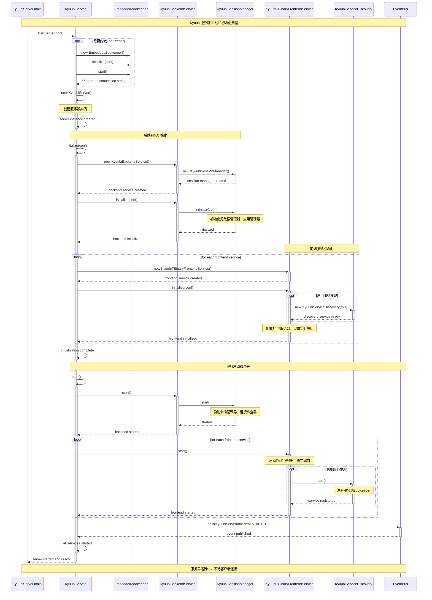
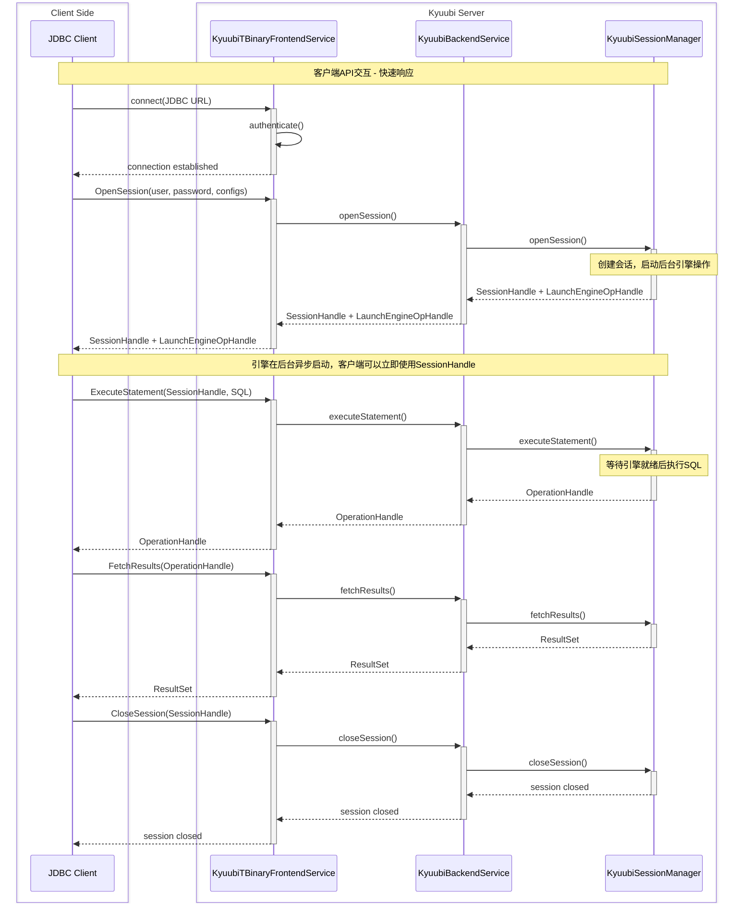
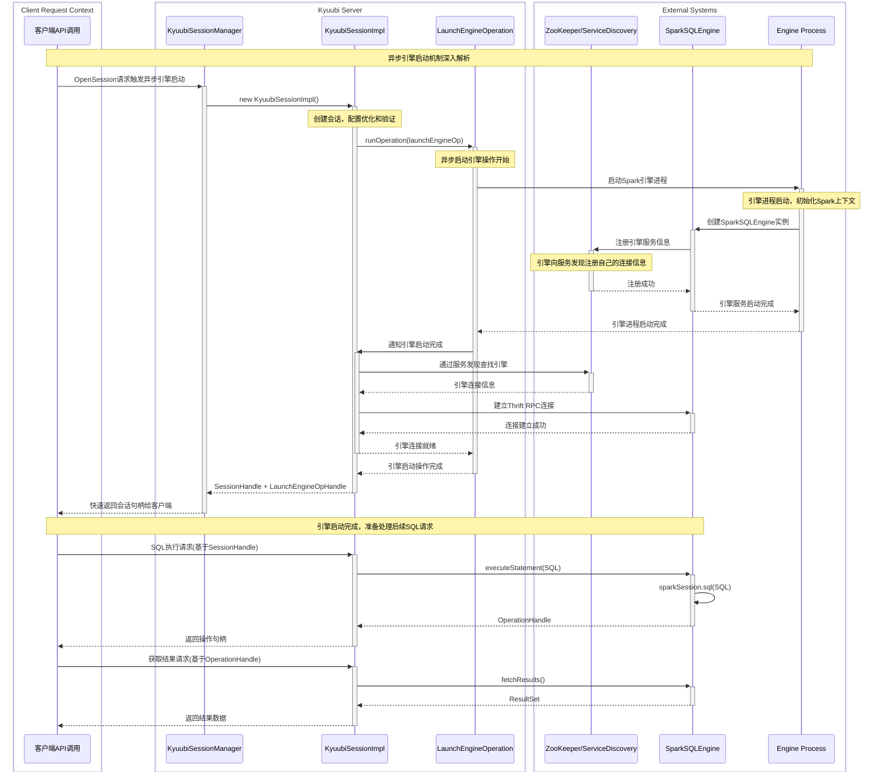

# Kyuubi 时序图

## 服务器启动

``` mermaid
---
config:
theme: mc
---
sequenceDiagram
participant Main as KyuubiServer.main
participant Server as KyuubiServer
participant ZK as EmbeddedZookeeper
participant Backend as KyuubiBackendService
participant SessionMgr as KyuubiSessionManager
participant ThriftFE as KyuubiTBinaryFrontendService
participant Discovery as KyuubiServiceDiscovery
participant EventBus as EventBus
Note over Main,EventBus: Kyuubi 服务器启动和初始化流程
Main->>+Server: startServer(conf)
opt 需要内嵌ZooKeeper
Server->>+ZK: new EmbeddedZookeeper()
Server->>ZK: initialize(conf)
Server->>ZK: start()
ZK-->>-Server: ZK started, connection string
end
Server->>+Server: new KyuubiServer()
Note over Server: 创建服务器实例
Server-->>-Server: server instance created
Note over Server,SessionMgr: 后端服务初始化
Server->>+Server: initialize(conf)
Server->>+Backend: new KyuubiBackendService()
Backend->>+SessionMgr: new KyuubiSessionManager()
SessionMgr-->>-Backend: session manager created
Backend-->>-Server: backend service created
Server->>+Backend: initialize(conf)
Backend->>+SessionMgr: initialize(conf)
Note over SessionMgr: 初始化元数据管理器、应用管理器
SessionMgr-->>-Backend: initialized
Backend-->>-Server: backend initialized
Note over ThriftFE,Discovery: 前端服务初始化
loop for each frontend service
Server->>+ThriftFE: new KyuubiTBinaryFrontendService()
ThriftFE-->>-Server: frontend service created
Server->>+ThriftFE: initialize(conf)
opt 启用服务发现
ThriftFE->>+Discovery: new KyuubiServiceDiscovery(this)
Discovery-->>-ThriftFE: discovery service ready
end
Note over ThriftFE: 配置Thrift服务器、设置监听端口
ThriftFE-->>-Server: frontend initialized
end
Server-->>-Server: initialization complete
Note over Server,EventBus: 服务启动和注册
Server->>+Server: start()
Server->>+Backend: start()
Backend->>+SessionMgr: start()
Note over SessionMgr: 启动会话管理器、连接检查器
SessionMgr-->>-Backend: started
Backend-->>-Server: backend started
loop for each frontend service
Server->>+ThriftFE: start()
Note over ThriftFE: 启动Thrift服务器、绑定端口
opt 启用服务发现
ThriftFE->>+Discovery: start()
Note over Discovery: 注册服务到ZooKeeper
Discovery-->>-ThriftFE: service registered
end
ThriftFE-->>-Server: frontend started
end
Server->>+EventBus: post(KyuubiServerInfoEvent.STARTED)
EventBus-->>-Server: event published
Server-->>-Server: all services started
Server-->>-Main: server started and ready
Note over Main,EventBus: 服务器运行中，等待客户端连接
```

## 客户端交互

专注于客户端视角，展示快速的API交互体验。

```mermaid
sequenceDiagram
    box Client Side
        participant Client as JDBC Client
    end

    box Kyuubi Server
        participant Frontend as KyuubiTBinaryFrontendService
        participant Backend as KyuubiBackendService
        participant SessionMgr as KyuubiSessionManager
    end

    Note over Client, SessionMgr: 客户端API交互 - 快速响应
    Client ->>+ Frontend: connect(JDBC URL)
    Frontend ->> Frontend: authenticate()
    Frontend -->>- Client: connection established
    Client ->>+ Frontend: OpenSession(user, password, configs)
    Frontend ->>+ Backend: openSession()
    Backend ->>+ SessionMgr: openSession()
    Note over SessionMgr: 创建会话，启动后台引擎操作
    SessionMgr -->>- Backend: SessionHandle + LaunchEngineOpHandle
    Backend -->>- Frontend: SessionHandle + LaunchEngineOpHandle
    Frontend -->>- Client: SessionHandle + LaunchEngineOpHandle
    Note over Client, SessionMgr: 引擎在后台异步启动，客户端可以立即使用SessionHandle
    Client ->>+ Frontend: ExecuteStatement(SessionHandle, SQL)
    Frontend ->>+ Backend: executeStatement()
    Backend ->>+ SessionMgr: executeStatement()
    Note over SessionMgr: 等待引擎就绪后执行SQL
    SessionMgr -->>- Backend: OperationHandle
    Backend -->>- Frontend: OperationHandle
    Frontend -->>- Client: OperationHandle
    Client ->>+ Frontend: FetchResults(OperationHandle)
    Frontend ->>+ Backend: fetchResults()
    Backend ->>+ SessionMgr: fetchResults()
    SessionMgr -->>- Backend: ResultSet
    Backend -->>- Frontend: ResultSet
    Frontend -->>- Client: ResultSet
    Client ->>+ Frontend: CloseSession(SessionHandle)
    Frontend ->>+ Backend: closeSession()
    Backend ->>+ SessionMgr: closeSession()
    SessionMgr -->>- Backend: session closed
    Backend -->>- Frontend: session closed
    Frontend -->>- Client: session closed
```

## Kyuubi异步引擎启动机制

深入展示KyuubiSessionImpl如何异步启动和连接引擎。

```mermaid
sequenceDiagram
    box Client Request Context
        participant ClientAPI as 客户端API调用
    end

    box Kyuubi Server
        participant SessionMgr as KyuubiSessionManager
        participant Session as KyuubiSessionImpl
        participant LaunchOp as LaunchEngineOperation
    end

    box External Systems
        participant ZK as ZooKeeper/ServiceDiscovery
        participant Engine as SparkSQLEngine
        participant EngineProcess as Engine Process
    end

    Note over ClientAPI, EngineProcess: 异步引擎启动机制深入解析
    ClientAPI ->>+ SessionMgr: OpenSession请求触发异步引擎启动
    SessionMgr ->>+ Session: new KyuubiSessionImpl()
    Note over Session: 创建会话，配置优化和验证
    Session ->>+ LaunchOp: runOperation(launchEngineOp)
    Note over LaunchOp: 异步启动引擎操作开始
    LaunchOp ->>+ EngineProcess: 启动Spark引擎进程
    Note over EngineProcess: 引擎进程启动，初始化Spark上下文
    EngineProcess ->>+ Engine: 创建SparkSQLEngine实例
    Engine ->>+ ZK: 注册引擎服务信息
    Note over ZK: 引擎向服务发现注册自己的连接信息
    ZK -->>- Engine: 注册成功
    Engine -->>- EngineProcess: 引擎服务启动完成
    EngineProcess -->>- LaunchOp: 引擎进程启动完成
    LaunchOp ->>+ Session: 通知引擎启动完成
    Session ->>+ ZK: 通过服务发现查找引擎
    ZK -->>- Session: 引擎连接信息
    Session ->>+ Engine: 建立Thrift RPC连接
    Engine -->>- Session: 连接建立成功
    Session -->>- LaunchOp: 引擎连接就绪
    LaunchOp -->>- Session: 引擎启动操作完成
    Session -->>- SessionMgr: SessionHandle + LaunchEngineOpHandle
    SessionMgr -->>- ClientAPI: 快速返回会话句柄给客户端
    Note over ClientAPI, Engine: 引擎启动完成，准备处理后续SQL请求
    ClientAPI ->>+ Session: SQL执行请求(基于SessionHandle)
    Session ->>+ Engine: executeStatement(SQL)
    Engine ->> Engine: sparkSession.sql(SQL)
    Engine -->>- Session: OperationHandle
    Session -->>- ClientAPI: 返回操作句柄
    ClientAPI ->>+ Session: 获取结果请求(基于OperationHandle)
    Session ->>+ Engine: fetchResults()
    Engine -->>- Session: ResultSet
    Session -->>- ClientAPI: 返回结果数据
```